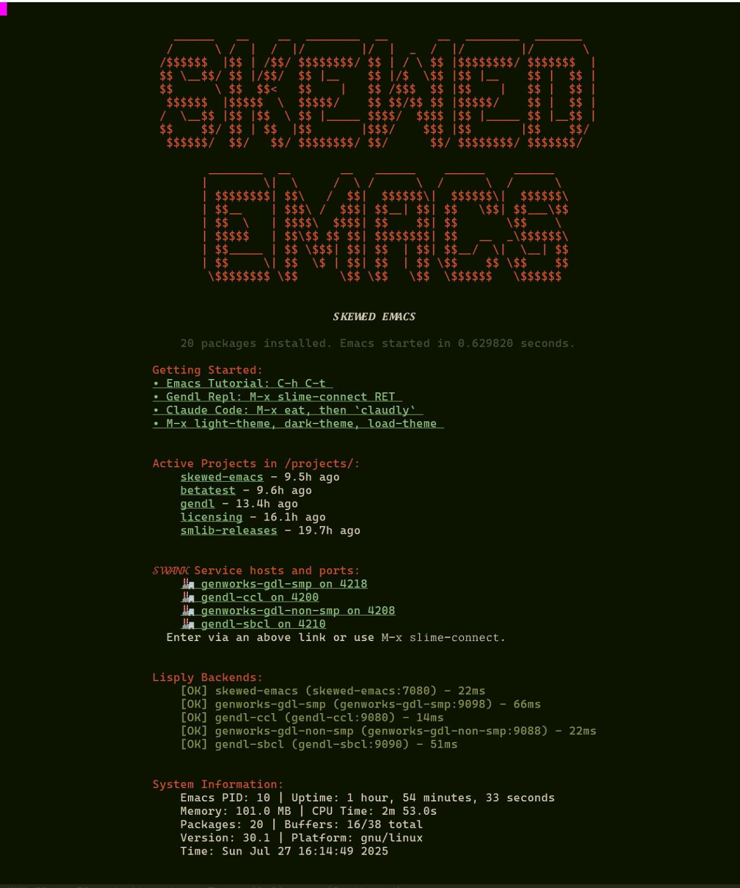

# Skewed Emacs: Containerized MCP Setup for Emacs Lisp and Common Lisp

Skewed Emacs is a containerized Emacs development environment with
Model Context Protocol (MCP) integration, enabling AI agents to
interact directly with Emacs and other Lisp REPLs for automated
development workflows.



This README assumes that you have access to a system with a
[bash](https://www.gnu.org/software/bash/) shell and
[docker](https://www.docker.com/get-started) available.

## What Can This Do for Me

This Skewed Emacs repository houses essentially three things:

1.  a ready-to-go Emacs configuration
   
2.  a containerized emacs server with pre-configured skewed emacs user 

3.  a container orchestration to bring in supplemental compatible
    backend container services for e.g. Model Context Protocol and
    Knowledge Based Engineering.


## Features

- **A Sampling of Included Emacs Packages:**
  - [Slime](https://en.wikipedia.org/wiki/SLIME) for Common Lisp / Swank
  - Paredit-mode, Flycheck-mode, Company-mode
  - Magit, Org-mode
  - Doom Color Themes, theme switching functions

- **Lisply-MCP (Model Context Protocol) Backend:**
  - allows AI agents to drive your contained emacs.
  - Defined in this repository and sideloaded from
    `dot-files/emacs.d/sideloaded/lisply-backend/`

- **Docker Integration:**
  - Local container image defined in `docker/Dockerfile` and `docker/build`.
    Images are pushed to tagged `gornskew/skewed-emacs` versions at Dockerhub.
  - Docker Compose orchestration for running configured skewed-emacs with
    other helpful containers such as lisply-mcp for the Lisply-MCP compatible middleware.


## Windows Keyboard Tweaks for Emacs

Skewed-emacs uses the traditional Emacs keybindings by default, which
make heavy use of the Control key ("C-" in emacs parlance). For this
reason, it can be convenient to bind a more ergonomic key such as
CapsLock to Control, on modern keyboards. (Older keyboards had Control
in the place of current CapsLock). The Skewed Emacs repository
contains [instructions](windows-keybindings/README.md) for mapping
CapsLock to Control (with or without WSL) using a free program called
SharpKeys.

If you enjoy the traditional emacs keychords and want more of them in
your life, you can replicate those across most Windows programs using
the free AutoHotkey program, for which we bundle a config, also
described in the [instructions](windows-keybindings/README.md).


## Containerized Runnings (recommended)

This is the easiest way to get everything started.

The steps below assume that you have access to a system with a
[bash](https://www.gnu.org/software/bash/) shell and [docker](https://www.docker.com/get-started) available.

### Initial Setup

1. Make a `~/projects/` directory if you don't already have one:

```bash

    cd
    mkdir -p projects/
    cd projects/
    
```

2. Clone this repo into `~/projects/`:

```bash

   git clone https://github.com/gornskew/skewed-emacs 
   cd skewed-emacs

```

3. Start the default container orchestra:

```
   ./compose-dev up
   
```

This will pull and starts four containers:
- **skewed-emacs**: Emacs with Benefits 
- **gendl-ccl**: Gendl system on Clozure CL
- **gendl-sbcl**: Gendl system on Steel Bank CL
- **lisply-mcp**: Node.js environment MCP & Claude


Now you can use the `eskew` or `egskew` aliases to launch a terminal-
or graphical-based emacs client. These aliases are defined in the
`dot-files/bash_profile`, so if you did not run the `~/.setup` on your
host machine, you can quickly define thes aliases for yourself with

```
  cd ~/projects/skewed-emacs/
  source dot-files/bash_profile
  
```

You can then do `eskew` or `egskew` to get a client attached to the
containerized skewed emacs daemon.

After you are in, see the "Getting Started" section near the top of
the default landing dashboard.

### Pulling Updates

While the `./compose-dev up` will pull fresh container images, it will
not automatically pull git updates to your local cloned skewed-emacs
repository. To do that:

```
cd ~/projects/skewed-emacs
./compose-dev down
git pull
./compose-dev up
```

As you can see, we bring down the docker composition before doing the
git pull, just in case there is a change in docker compose
configuration that might affect a shutdown.


### Troubleshooting

- *Dangling Containers*

If all containers do not shut down cleanly for some reason, you can
list them with

```
docker ps 
```

then forcibly remove one with

```
docker rm -f <container-name>
```

- *Dangling Network*

Sometimes a docker network "skewed-network" or "skewed-emacs-network"
can be left dangling, preventing a clean `./compose-dev up`. Such
cases can be cleaned up with e.g.

```
cd ~/projects/skewed-emacs/
./compose-dev down 
docker network rm skewed-emacs # if for some reason necessary
./compose-dev up 
```


## Local Installation

This section is for setting up the `.emacs.d` and other so-called "dot
files" in your home directory. It does not download or install or run
any of the systems discussed in the Containerized Runnings section
above.

1. Make a `~/projects/` directory if you don't already have one:

```bash

    cd
    mkdir -p projects/
    cd projects/
    
```

2. Clone this repo into `~/projects/`:

```bash

   git clone https://github.com/gornskew/skewed-emacs 
   cd skewed-emacs

```


3. Run the setup script:
   ```bash
   
   cd ~/projects/skewed-emacs
   ./setup
   
   ```
   
   The setup script will create symbolic links of the salient
   "dot-files" (hidden files starting with `.` pointing to the
   corresponding files in the cloned repo, for example:
   
    `~/.emacs.d -> ~/skewed-emacs/dot-files/emacs.d`
   
   If you already have any of these dot files existing (as links or
   actual files/directories), the existing files will be backed up
   with names appended with `-pre-skewed-emacs`.


### Optional options for `setup`

- `--dry-run`: Shows what would happen without making any changes
- `--shadow-suffix=NAME` or `--shadow-suffix NAME`: Creates symlinks with a "-NAME" suffix
     (e.g., with `--shadow-suffix=test` or `--shadow-suffix test` creates ~/.emacs.d-test instead of ~/.emacs.d)
- `--scrub-shadow-suffix=NAME` or `--scrub-shadow-suffix NAME`: Removes all symlinks with the "-NAME" suffix
     (e.g., `--scrub-shadow-suffix=test` removes ~/.emacs.d-test, ~/.bash_profile-test, etc.)
- `--scrub-shadow-suffix=""` or `--scrub-shadow-suffix=`: Removes all default symlinks without a suffix (e.g., removes ~/.emacs.d, ~/.bash_profile, etc.)

The setup script will automatically detect and replace broken symlinks
and handle existing dotfiles by backing them up with a
`-pre-skewed-emacs` suffix. It also skips backup files ending with
tilde (~) in the dot-files directory.

##   Example with options:

```bash
   # Preview changes without modifying anything
   ./setup --dry-run
   
   # Install configuration files with regular names
   ./setup
   
   # Install configuration files with "-shadow" suffix
   # (useful for testing or for maintaining multiple configurations)
   ./setup --shadow-suffix=shadow
   
   # Install with a custom suffix
   ./setup --shadow-suffix=work
   
   # Preview shadow installation without making changes
   ./setup --dry-run --shadow-suffix=shadow
   
   # Preview custom suffix installation without making changes
   ./setup --dry-run --shadow-suffix=test
   
   # Remove all symlinks with the "-test" suffix
   ./setup --scrub-shadow-suffix=test
   
   # Preview removal of all symlinks with the "-shadow" suffix without making changes
   ./setup --dry-run --scrub-shadow-suffix=shadow
   
   # Remove all symlinks with the "-test" suffix and create new ones with "-work" suffix
   ./setup --scrub-shadow-suffix=test --shadow-suffix=work
   
   # Preview removing all symlinks with the "-test" suffix and creating
   
```


⚠️ **Warning**: The setup script may overwrite your existing
               `~/.emacs.d/` and `~/.bash_profile`. It is designed to
               back up this data, but in case of defects or failure it
               would be wise to back up your existing dot files before
               running the `./setup` script.
	       

## Requirements

 - Bash
 - Docker 
 - Git


## Configuration Structure

 - `dot-files/` - all dotfiles that will end up symlinked to
   your home directory
  - `emacs.d/` - Emacs configuration, to be linked to ~/.emacs.d/
    - `init.el` - Main Emacs configuration entry point
    - `etc/` - Modular configuration files
    - `sideloaded/` - Second-party packages
  - `bash_profile` - Bash configuration
  - `tmux.conf` - tmux configuration
  - `zshrc` - ZSH configuration


## Customization

For personal customizations that shouldn't be committed to this
repository, add them to a `~/.emacs-local` file, which will be loaded
at the end of the Emacs initialization process.


## License

This package is licensed under the GNU Affero General Public License
v3.0 (AGPL-3.0) which presumably is compatible with Gnu Emacs's GPL.

## MCP Server Registries

- [MCPHub](https://mcphub.com/mcp-servers/gornskew/skewed-emacs)
