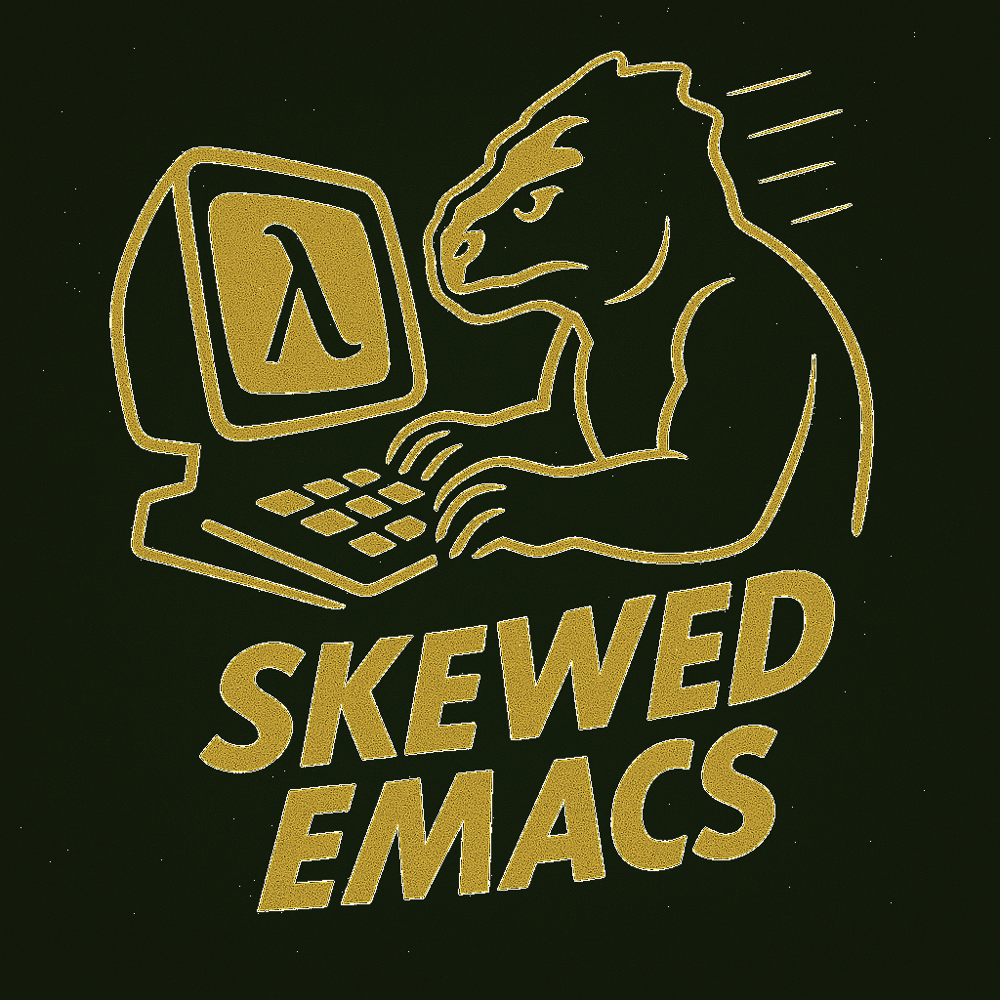

# Skewed Emacs: A Handy Setup for Gnu Emacs, Gendl, and AI



A comprehensive, opinionated configuration for Emacs and Unix
environments, optimized for Lisp/Gendl development (especially with
SLIME), modern tooling integration, and a developer-friendly shell
experience.

## Features

- **Emacs Configuration:**
  - Modern package management via straight.el
  - SLIME setup for Common Lisp development with extensive customizations
  - AI assistance integration (Copilot, GPT, Claude, and more)
  - Built-in MCP (Model Context Protocol) server for AI assistants
  - Org-mode configuration
  - Magit for Git integration
  - Various quality-of-life improvements and custom keybindings

- **Terminal/Shell Integration:**
  - Custom bash profile with useful functions and aliases for Emacs and Gendl
  - Gendl integration via the `gswank` and `rgc` functions
  - tmux configuration
  - Shell script utilities
  - Cross-platform support (including WSL)

- **Docker Integration:**
  - Helper functions for running containerized environments
  - Development container setup

## Installation

1. Clone this repo anywhere on your filesystem:
   ```bash
   git clone <repository-url> skewed-emacs
   ```

2. Run the setup script:
   ```bash
   cd skewed-emacs
   ./setup
   ```
   
   The setup script will create symlinks to the configuration files regardless of where you've cloned the repository.

   Available options:
   - `--dry-run`: Shows what would happen without making any changes
   - `--shadow-suffix=NAME` or `--shadow-suffix NAME`: Creates symlinks with a "-NAME" suffix
     (e.g., with `--shadow-suffix=test` or `--shadow-suffix test` creates ~/.emacs.d-test instead of ~/.emacs.d)
   - `--shadow-suffix=shadow`: Creates symlinks with a "-shadow" suffix
   - `--shadow-suffix=""` or `--shadow-suffix=`: Explicitly specifies standard installation mode (no suffix)
     (using this option is optional, as it's the default behavior)
   - `--scrub-shadow-suffix=NAME` or `--scrub-shadow-suffix NAME`: Removes all symlinks with the "-NAME" suffix
     (e.g., `--scrub-shadow-suffix=test` removes ~/.emacs.d-test, ~/.bash_profile-test, etc.)
   - `--scrub-shadow-suffix=""` or `--scrub-shadow-suffix=`: Removes all default symlinks without a suffix
     (e.g., removes ~/.emacs.d, ~/.bash_profile, etc.)

   The setup script will automatically detect and replace broken symlinks and handle existing dotfiles by backing them up with a `-pre-skewed-emacs` suffix. It also skips backup files ending with tilde (~) in the dot-files directory.

   Example with options:
   ```bash
   # Preview changes without modifying anything
   ./setup --dry-run
   
   # Install configuration files with regular names
   ./setup
   
   # Install configuration files with "-shadow" suffix
   # (useful for testing or for maintaining multiple configurations)
   ./setup --shadow-suffix=shadow
   
   # Install with a custom suffix
   ./setup --shadow-suffix=work
   
   # Preview shadow installation without making changes
   ./setup --dry-run --shadow-suffix=shadow
   
   # Preview custom suffix installation without making changes
   ./setup --dry-run --shadow-suffix=test
   
   # Remove all symlinks with the "-test" suffix
   ./setup --scrub-shadow-suffix=test
   
   # Preview removal of all symlinks with the "-shadow" suffix without making changes
   ./setup --dry-run --scrub-shadow-suffix=shadow
   
   # Remove all symlinks with the "-test" suffix and create new ones with "-work" suffix
   ./setup --scrub-shadow-suffix=test --shadow-suffix=work
   
   # Preview removing all symlinks with the "-test" suffix and creating new ones with "-work" suffix
   ./setup --dry-run --scrub-shadow-suffix=test --shadow-suffix=work
   
   # Explicitly use standard installation (same as default, without any suffix)
   ./setup --shadow-suffix=""
   ```

⚠️ **Warning**: The setup script will overwrite your existing
`.emacs.d` directory and several dotfiles in your home directory. Existing files will be backed up with a `-pre-skewed-emacs` suffix. Run
it with `--dry-run` first to see what it will do without it touching
anything.

## Requirements

- Emacs 29+ recommended 
- Node.js 22+ (for Copilot and AI integrations)
- Docker (optional, for containerized development)
- Git
- realpath (included in coreutils on Linux; on macOS install via Homebrew: `brew install coreutils`)

## Configuration Structure

- `dot-files/` - Contains all dotfiles that will be symlinked to your home directory
  - `emacs.d/` - Emacs configuration, to be linked to ~/.emacs.d/
    - `init.el` - Main Emacs configuration entry point
    - `etc/` - Modular configuration files
    - `sideloaded/` - Third-party packages
  - `bash_profile` - Bash configuration
  - `tmux.conf` - tmux configuration
  - `zshrc` - ZSH configuration

- `notes/` - Documentation and setup guides

## Customization

For personal customizations that shouldn't be committed to this repository, add them to a `~/.emacs-local` file, which will be loaded at the end of the Emacs initialization process.

## Installation Options and Rationale

Skewed Emacs is not currently designed to blend automatically with your existing configuration. You have two installation approaches to choose from:

### 1. Regular Installation (Default)

With the standard installation approach, the `./setup` script will:

- Back up your existing dotfiles with a `-pre-skewed-emacs` suffix
- Replace them with symlinks to the Skewed Emacs versions
- Allow you to merge your customizations back in a controlled manner

If you have your own preëxisting config, add it back in a stepwise,
deliberate manner in your `~/.emacs-local` file, which you can
version-control separately or together with your own private fork or
branch of this repo. Keeping your own .emacs-local in a separate repo
is cleaner -- that would be just two repositories to clone when you
sit down at or provision a new machine.

### 2. Shadow Installation (`--shadow-suffix=NAME`)

If you want to try Skewed Emacs without replacing your existing setup:

- Use `--shadow-suffix=shadow` to create parallel configuration files with a `-shadow` suffix
- Or use `--shadow-suffix=NAME` to create files with your own custom suffix

This approach is useful for:
- Testing the configuration without affecting your existing setup
- Maintaining multiple parallel configurations
- Gradually transitioning from your existing configuration
- Creating specific configurations for different purposes (e.g., one for work, one for personal projects)

#### Using Shadow Configurations

To launch Emacs with a shadow configuration (replace `SUFFIX` with your chosen suffix):

```bash
# Start Emacs with the shadow config
emacs -q --load "~/.emacs.d[SUFFIX]/init.el"
```

To use a shadow bash profile:

```bash
# Source the shadow bash profile in your current shell
source ~/.bash_profile[SUFFIX]
```

This makes it easy to maintain both your original configuration and multiple versions of Skewed Emacs simultaneously.

## MCP Server for AI Assistants

This configuration includes a built-in MCP (Model Context Protocol) server that allows AI assistants like Claude to interface directly with Emacs. With the MCP server, AI assistants can:

- Evaluate Emacs Lisp code
- Navigate and edit files
- Access buffers and perform editing operations
- Assist with complex development tasks

The MCP server is implemented in the `dot-files/emacs.d/sideloaded/mcp-service/` directory and can be configured to run in various environments including Docker containers for enhanced security. For more details, see the [MCP service README](/projects/skewed-emacs/dot-files/emacs.d/sideloaded/mcp-service/README.md).

## License

This package is licensed under the GNU Affero General Public License v3.0 (AGPL-3.0).
