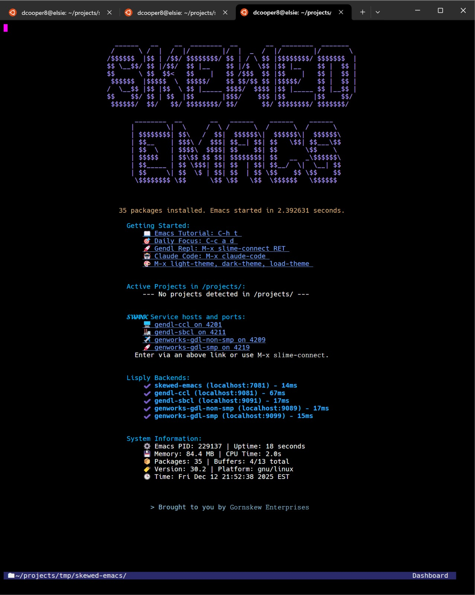

# Skewed Emacs: Ready-to-go, Opinionated Emacs Environment that supports MCP for elisp and Common Lisp

Skewed Emacs is a containerized Emacs development environment with a
package-rich, native-compiled emacs elisp user configuration, that
comes preconfigured and ready to use with the lisply-mcp Model Context
Protocol (MCP) middleware, enabling AI agents to interact directly
with Emacs and other compliant Lisp REPLs for automated development
workflows.

The Emacs configuration part could arguably be decomposed into a
separate repository, but on the other hand, in the interest of
one-stop-shopping, here we are.




## What Will I Find Here?

This Skewed Emacs repository houses essentially three assets:

1.  a ready-to-setup local Emacs configuration. This can be used on
    its own without (2) or (3) if desired.
   
2.  a Dockerfile for building a containerized emacs server with the
    skewed-emacs configuration (as per (1) above) preïnstalled for the
    built-in `emacs-user` user account.

3.  a container composition overlay framework (based on docker
    compose) that makes it easy to spin up a skewed-emacs container
    (as per (2) above) side-by-side with any number of "helper"
    containers, with immediate connectivity for http, Slime/Swank (for
    Common Lisp development), and MCP consumers including three
    built-in terminal-based ones that ship with the full variants of
    the skewed-emacs container images.


## Two Ways to Use This

**Option A — Containerized Runnings (recommended):** run
`./compose-dev up`.

This pulls and spins up several Docker containers and leaves your host
machine untouched except for two shell functions (`eskew`/`egskew`)
injected into your `~/.bashrc`. You do not need to run `./setup`. You
do not need Emacs installed on your host. You do need docker installed
on your host.

**Option B — Local Installation:** run `./setup`.  Installs the Skewed
Emacs dot-files and Emacs configuration directly into your host
account (`~/.emacs.d`, `~/.bash_profile`, etc.). Use this if you want
the Skewed Emacs configuration in your own personal host Emacs. Does
not start any containers, does not provide MCP support. You do need
emacs already installed on your host for it to make sense to use this.

**Both together:** you can do both — run `./setup` to get the
configuration in your host Emacs, *and* run `./compose-dev up` to also
have the full container orchestra with Gendl backends and MCP
integration. They are each idempotent as well as independent from each
other.

---


## Features

### Native Emacs Config

- **Pre-populated landing `*dashboard*` detecting and reporting on
    project files, services stati, links to org-mode daily-focus,
    launch slime against available CL backends etc.

- **Preïnstalled, pre-native-compiled third-party packages:**
  - [Slime](https://en.wikipedia.org/wiki/SLIME) for Common Lisp / Swank
  - Paredit-mode, Flycheck-mode, Company-mode
  - Magit, Org-mode
  - Doom Color Themes, theme switching functions

- **Lisply-MCP (Model Context Protocol) Elisp Backend:**
  - allows AI agents to drive your contained emacs thru standard lisply-mcp.
  - Defined & sideloaded locally from
    `dot-files/emacs.d/sideloaded/lisply-backend/`


- **Additional Container-defined Infrastructure** (see Containerized Runnings below)
  - Local container image defined in `docker/Dockerfile` and `docker/build`.
    Images built by Gornskew HQ are pushed to tagged `gornskew/skewed-emacs` versions at Dockerhub.
  - Includes a Docker Compose orchestration for running a skewed-emacs
    with other helpful containers such as Common Lisp based
    ones.
  - Docker Compose orchestration includes built-in lisply-mcp
    middleware to provide consumer-facing MCP services for
    skewed-emacs itself plus any other lisply-compliant backends.


## Containerized Runnings (recommended)

Everything runs inside Docker containers — **you do not run `./setup`,
install dot-files, or modify your Emacs configuration on the host.**
Your host machine stays clean. The only intentional side effect is that
`./compose-dev up` adds `eskew` and `egskew` to your `~/.bashrc`.

### Requirements

 - Git
 - Docker — see [macOS-Specific Section](#macos-specific-section) if on a Mac


### Initial Setup

1. Make a `~/projects/` directory if you don't already have one:

```bash

    cd
    mkdir -p projects/
    cd projects/
    
```

2. Clone this repo into `~/projects/`:

```bash

   git clone https://github.com/gornskew/skewed-emacs 
   cd skewed-emacs

```

3. Start the default container orchestra:

```
   ./compose-dev up
   
```

By default this pulls missing images only (no overwrites of local builds).
To force pulling the latest images, use:

```
   ./compose-dev up --pull
```

Services are defined in `docker-compose.yml` and any other `.yml`
files in this directory (docker-compose.yml is generated from
`services.sexp`, while additional .yml files may be brought into your
local working clone).

After the stack starts, `eskew` and `egskew` should be available
immediately and henceforth in any new bash shells on your host — these
are the **only** commands you need from the host to drive the
containerized Emacs:

- `eskew` — terminal emacsclient (attaches in your current terminal)
- `egskew` — graphical emacsclient (opens a new window)

`./compose-dev up` writes these to
`~/.config/skewed-emacs/shell-functions.sh` and adds a single source
line to your `~/.bashrc`. This is the **only modification** made to
your host environment. Open a new terminal (or `source ~/.bashrc`) to
activate them.


After you are in, see the "Getting Started" section near the top of
the default landing dashboard.

### Claude Desktop Integration

If you want to activate Claude Desktop and let it talk to your
skewed-emacs and friends via MCP, see [Claude Desktop
Integration](docs/CLAUDE_DESKTOP.md) for setup instructions. The MCP
configuration is automatically generated when you run `./compose-dev
up`.

### Pulling Updates

Please keep both your cloned skewed-emacs repository and any
skewed-emacs containers fresh, by pulling frequently.

#### Pulling newest skewed-emacs docker image from Dockerhub

`./compose-dev up` pulls missing images only by default. If you want
fresh images, use `./compose-dev up --pull` (or set `PULL_ALWAYS=1`).


#### Pulling this Git Repo from Upstream

The best way is to pull skewed-emacs container image and all other
related images with `--pull`:

```
cd ~/projects/skewed-emacs
./compose-dev down
git pull
./compose-dev up --pull
```

As you can see, we bring down the docker composition before doing the
git pull, just in case there is a change in docker compose
configuration that might affect a shutdown.


### AI Terminal Agents (Claude Code, Gemini CLI, Codex)

The `full` image variant includes three AI terminal agents, accessible
from any shell inside the container (e.g. via `M-x vterm`):

| Agent | Launch Command | Auth Method |
|-------|---------------|-------------|
| Claude Code | `claudly` | Interactive OAuth (opens URL to paste in browser) |
| Gemini CLI | `geminly` | Interactive OAuth (opens URL to paste in browser) |
| OpenAI Codex | `codexly` | Interactive login or `OPENAI_API_KEY` env var |

**First-time authentication:**

Each agent requires a one-time login. Launch the agent from a
terminal inside the container and follow the prompts — typically
you'll be given a URL to open in your browser.

```bash
# In an eat or vterm shell inside skewed-emacs:
claudly    # Follow the OAuth URL prompt
geminly    # Follow the Google OAuth prompt
codexly    # Follow the login prompt, or set OPENAI_API_KEY
```

**Credential persistence:**

Your credentials are stored in dotfiles that are volume-mounted from
your host, so they survive container restarts:

- Claude Code: `~/.claude/.credentials.json`
- Gemini CLI: `~/.gemini/oauth_creds.json`, `~/.gemini/google_accounts.json`
- Codex: `~/.codex/auth.json`

The `compose-dev` script should automatically create these as empty
placeholder files on your host if they don't exist yet.

**Using the `lite` image:**

If you use `EMACS_IMAGE_VARIANT=lite`, these agents are not installed.
An external host MCP consumer such as Claude Desktop can still be
used, via the MCP config generated at `./compose-dev up` time and
written to `skewed-emacs/mcp/`.


### Supplemental Service Overlays (Commercial GDL)

The base skewed-emacs stack includes three Lisp environments:

- **skewed-emacs** — Emacs Lisp (via MCP)
- **gendl-ccl** — Free Gendl kernel on Clozure CL
- **gendl-sbcl** — Free Gendl kernel on SBCL

For commercial Genworks GDL (with NURBS modeling primitives and
Allegro CL), licensed users receive a supplemental overlay repository.
To install an overlay:

```bash
cd ~/projects/
git clone <overlay-repo-url>    # e.g. genworks-gdl-betatest
cd <overlay-repo>/
./install                       # copies configs into ../skewed-emacs/
cd ../skewed-emacs/
./compose-dev up                # picks up overlay automatically
```

The `./install` script copies Docker Compose overlays (`.yml` files)
and MCP config overlays into skewed-emacs. Docker Compose
automatically merges all `.yml` files in the directory, and
`compose-dev up` merges MCP configs for all services.

### Custom Projects Directory

`./compose-dev` generates `.env` via `./generate-env.sh`. Do not edit
`.env` directly. To use a non-default projects directory, set
`PROJECTS_DIR` before running:

```
PROJECTS_DIR=/path/to/projects ./compose-dev up
```

### Troubleshooting

- *Dangling Containers*

If all containers do not shut down cleanly for some reason, you can
list them with

```
docker ps 
```

then forcibly remove one with

```
docker rm -f <container-name>
```

- *Dangling Network*

Sometimes a docker network "skewed-network" or "skewed-emacs-network"
can be left dangling, preventing a clean `./compose-dev up`. Such
cases can be cleaned up with e.g.

```
cd ~/projects/skewed-emacs/
./compose-dev down 
docker network rm skewed-emacs # if for some reason necessary
./compose-dev up 
```

## Windows-Specific Section

### Emacs-slanted Keyboard Tweaks for Windows

Skewed-emacs uses the traditional Emacs keybindings by default, which
make heavy use of the Control key ("C-" in emacs parlance). For this
reason, it can be convenient to bind a more ergonomic key such as
CapsLock to Control, on modern keyboards. (Older keyboards had Control
in the place of current CapsLock). The Skewed Emacs repository
contains [instructions](windows-keybindings/README.md) for mapping
CapsLock to Control (with or without WSL) using a free program called
SharpKeys.

If you enjoy the traditional emacs keychords and want more of them in
your life, you can replicate those across most Windows programs using
the free AutoHotkey program, for which we bundle a config, also
described in the [instructions](windows-keybindings/README.md).

## macOS-Specific Section

### macOS Prerequisites

`compose-dev` is pure POSIX sh — no special shell is required on macOS.
The only requirement is **Docker Desktop**.

#### Install Docker Desktop

Install [Docker Desktop for Mac](https://www.docker.com/products/docker-desktop/)
if you haven't already, then confirm:

```bash
docker info   # should print engine info without errors
```

Once Docker is running, `./compose-dev up` will work normally.

---


## Local Installation

This section is for users who want to install the Skewed Emacs dot-files
and Emacs configuration **directly on their host machine**, without
Docker. It is independent of Containerized Runnings — do not run
`./setup` as part of a container-based setup; it is not needed and
not intended for that use case.


1. Make a `~/projects/` directory if you don't already have one:

```bash

    cd
    mkdir -p projects/
    cd projects/
    
```

2. Clone this repo into `~/projects/`:

```bash

   git clone https://github.com/gornskew/skewed-emacs 
   cd skewed-emacs

```


3. Run the setup script:
   ```bash
   
   cd ~/projects/skewed-emacs
   ./setup
   
   ```
   
   The setup script will create symbolic links of the salient
   "dot-files" (hidden files starting with `.` pointing to the
   corresponding files in the cloned repo, for example:
   
    `~/.emacs.d -> ~/skewed-emacs/dot-files/emacs.d`
   
   If you already have any of these dot files existing (as links or
   actual files/directories), the existing files will be backed up
   with names appended with `-pre-skewed-emacs`.


### Optional options for `setup`

- `--dry-run`: Shows what would happen without making any changes
- `--shadow-suffix=NAME` or `--shadow-suffix NAME`: Creates symlinks with a "-NAME" suffix
     (e.g., with `--shadow-suffix=test` or `--shadow-suffix test` creates ~/.emacs.d-test instead of ~/.emacs.d)
- `--scrub-shadow-suffix=NAME` or `--scrub-shadow-suffix NAME`: Removes all symlinks with the "-NAME" suffix
     (e.g., `--scrub-shadow-suffix=test` removes ~/.emacs.d-test, ~/.bash_profile-test, etc.)
- `--scrub-shadow-suffix=""` or `--scrub-shadow-suffix=`: Removes all default symlinks without a suffix (e.g., removes ~/.emacs.d, ~/.bash_profile, etc.)

The setup script will automatically detect and replace broken symlinks
and handle existing dotfiles by backing them up with a
`-pre-skewed-emacs` suffix. It also skips backup files ending with
tilde (~) in the dot-files directory.

####   Example with options:

```bash
   # Preview changes without modifying anything
   ./setup --dry-run
   
   # Install configuration files with regular names
   ./setup
   
   # Install configuration files with "-shadow" suffix
   # (useful for testing or for maintaining multiple configurations)
   ./setup --shadow-suffix=shadow
   
   # Install with a custom suffix
   ./setup --shadow-suffix=work
   
   # Preview shadow installation without making changes
   ./setup --dry-run --shadow-suffix=shadow
   
   # Preview custom suffix installation without making changes
   ./setup --dry-run --shadow-suffix=test
   
   # Remove all symlinks with the "-test" suffix
   ./setup --scrub-shadow-suffix=test
   
   # Preview removal of all symlinks with the "-shadow" suffix without making changes
   ./setup --dry-run --scrub-shadow-suffix=shadow
   
   # Remove all symlinks with the "-test" suffix and create new ones with "-work" suffix
   ./setup --scrub-shadow-suffix=test --shadow-suffix=work
   
   
```


⚠️ **Warning**: In case of malfunctions, the setup script may
               overwrite your existing `~/.emacs.d/` and
               `~/.bash_profile`. It is designed to back up this data,
               but it would still be wise to back up your existing dot
               files before running the `./setup` script.
	       


## Terminal Icons Setup 

Skewed Emacs includes a flexible icon system for the dashboard and
org-mode agenda. By default we use colorful Unicode icons. If these do
not work in your terminal, or you'd like a more muted experience, we
recommend installing a **Nerd Font** in your terminal.

### Why Nerd Fonts?

With a Nerd Font installed, you can get flat professional looking
icons rather than loud colorful gaudy ones.

### Quick Setup

1. **Download a Nerd Font** from [nerdfonts.com](https://www.nerdfonts.com/font-downloads)
   - Popular choices: **Hack**, **FiraCode**, **JetBrainsMono**, **Meslo**
   - Download the "Nerd Font" version (not the regular font)

2. **Install the font** on your system:
   - **Windows**: Right-click the `.ttf` files → "Install"
   - **macOS**: Double-click the `.ttf` files → "Install Font"
   - **Linux**: Copy to `~/.local/share/fonts/` and run `fc-cache -fv`

3. **Configure your terminal** to use the Nerd Font:
   - **Windows Terminal**: Settings → Profiles → Defaults → Appearance → Font face
   - **iTerm2**: Preferences → Profiles → Text → Font
   - **GNOME Terminal**: Preferences → Profile → Custom font
   - **Alacritty**: Edit `font.normal.family` in config

4. **Enable nerd icons in Skewed Emacs** by adding to your config or running:
   ```elisp
   (setq skewed-icons-style 'nerd)
   ```
   Or interactively: `M-x skewed-icons-set-style RET nerd RET`

### Available Icon Styles

| Style | Description | When to Use |
|-------|-------------|-------------|
| `ascii` | Pure ASCII characters | Dumb terminals, serial consoles |
| `unicode` | Safe geometric symbols | Default, works everywhere |
| `unicode-fancy` | Colorful Unicode + VS15 | Experimental, terminal support varies |
| `nerd` | Nerd Font icons | **Recommended** with Nerd Font installed |


### Troubleshooting Icons

- **Question marks in diamonds (�)**: Nerd Font not installed or not selected in terminal
- **Misaligned columns**: Switch from `unicode-fancy` to `unicode` or `nerd`
- **Icons look plain**: Install a Nerd Font and set `skewed-icons-style` to `'nerd`


## Configuration Structure

 - `dot-files/` - all dotfiles that will end up symlinked to
   your home directory if you run `./setup`
  - `emacs.d/` - Emacs configuration, to be linked to ~/.emacs.d/
    - `init.el` - Main Emacs configuration entry point
    - `etc/` - Modular configuration files
    - `sideloaded/` - Second-party packages
  - `bash_profile` - Bash configuration
  - `zshrc` - ZSH configuration


## Customization

For personal customizations that shouldn't be committed to this
repository, add them to a `~/.emacs-local` file, which will be loaded
at the end of the Emacs initialization process.


## License

This package is licensed under the GNU Affero General Public License
v3.0 (AGPL-3.0) which presumably is compatible with Gnu Emacs's GPL.

## MCP Server Registries

- [MCPHub](https://mcphub.com/mcp-servers/gornskew/skewed-emacs)
